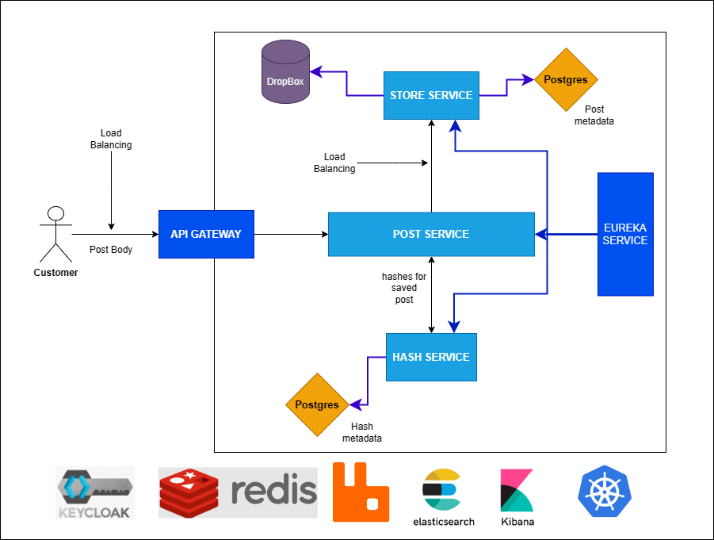

# Application for Saving And Sending Blocks of Text

### Pastebin project overview.

#### Implemented Features:

* Keycloak as user identity and access manager
* Redis as caching system
* MQ message system
* ELK system
* Kubernetes as container manager

#### Service Roles

* Spring Cloud Gateway as service routing system
* Spring Cloud Discovery for service registration and load balancing
* Post Service - main endpoint that takes posts
* Hash Service - creates short hashes for sent posts
* Store Service - for saving posts in cloud storage ( here dropbox ) and their metadata in db

#### Prerequisites
    Spring Boot v3.0.7
    Spring Cloud v2022.0.1
    Google Jib Library v3.3.1
    Keycloak v18.0.0
    *more soon*